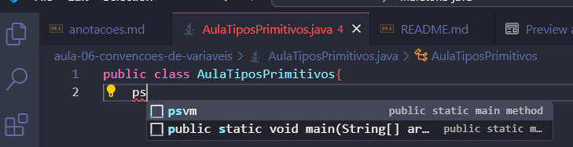
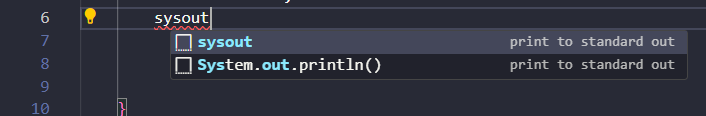

<h1>Java - anotações</h1>

- [Atalhos úteis no VS CODE](#atalhos-úteis-no-vs-code)
  - [Método main](#método-main)
  - [System.out.println();](#systemoutprintln)
- [Sobre o Java](#sobre-o-java)
  - [Java JDK](#java-jdk)
  - [Variáveis de Ambiente no Windows](#variáveis-de-ambiente-no-windows)
- [No terminal](#no-terminal)
  - [Saber a versão do Java](#saber-a-versão-do-java)
  - [Recompilar classe via terminal](#recompilar-classe-via-terminal)
    - [Executar uma classe via terminal](#executar-uma-classe-via-terminal)
  - [Classe com argumentos via terminal](#classe-com-argumentos-via-terminal)
- [IDE](#ide)
- [Pacotes](#pacotes)
- [Comentários](#comentários)
  - [Comentário de 1 linha](#comentário-de-1-linha)
  - [Comentário de múltiplas linhas](#comentário-de-múltiplas-linhas)
  - [Javadoc - é uma forma de documentar o código](#javadoc---é-uma-forma-de-documentar-o-código)
- [Tipos Primitivos no Java](#tipos-primitivos-no-java)
- [Variáveis](#variáveis)
- [Concatenando texto + número](#concatenando-texto--número)


# Atalhos úteis no VS CODE

## Método main
Para criar o método main em Java de forma mais rápida, dentro da classe ainda vazia digite `psvm` e selecione o método na lista.

```java
public class AulaTiposPrimitivos{
    psvm
}
```


Vai ficar assim:
```java
public class AulaTiposPrimitivos{
    public static void main(String[] args) {

    }
}
```

## System.out.println();
Para agilizar a escrita do `System.out.println();` digite `sysout`.

```java
public class AulaTiposPrimitivos{
    public static void main(String[] args) {
        // int, double, float, char, byte, short, long, boolean
        // nomes de variáveis sempre usando camelCase
        int idade = 10;
        sysout
    }
}
```

# Sobre o Java

Java SE, Java Platform, Standard Edition, é uma plataforma de desenvolvimento de software da Oracle Corporation, destinada ao desenvolvimento e implantação de aplicativos portáteis para desktops e servidores. Ela fornece as ferramentas necessárias para desenvolver e executar aplicativos Java, incluindo uma máquina virtual (JVM), compilador, biblioteca padrão de classes, e outras ferramentas de desenvolvimento.

Aqui estão alguns componentes principais do Java SE:

1. **Java Development Kit (JDK)**: Inclui a JVM, bibliotecas de classe, e ferramentas como o compilador (javac) e o depurador.
2. **Java Runtime Environment (JRE)**: Inclui a JVM e as bibliotecas de classe necessárias para rodar aplicativos Java. O JRE é um subconjunto do JDK.
3. **Java Virtual Machine (JVM)**: Uma máquina virtual que permite a execução de bytecode Java em qualquer plataforma. A JVM é responsável por gerenciar a execução do aplicativo Java.
4. **Bibliotecas de Classes**: Uma ampla coleção de bibliotecas pré-construídas que fornecem funcionalidades comuns como estruturas de dados, manipulação de arquivos, comunicação de rede, interfaces gráficas (Swing e JavaFX), e muito mais.
5. **Java API (Application Programming Interface)**: Conjunto de pacotes (bibliotecas) que ajudam os desenvolvedores a escrever aplicativos sem precisar se preocupar com a infraestrutura subjacente.

Java SE é a base para outras edições da plataforma Java, como **Java EE (Enterprise Edition)** e **Java ME (Micro Edition)**, que são construídas em cima da Java SE para atender a necessidades específicas de desenvolvimento.

Histórico de versões do Java: [https://bit.ly/3AbmJnK](https://bit.ly/3AbmJnK)

JCP - Java Community Process: [https://www.jcp.org/en/home/index](https://www.jcp.org/en/home/index)

O JCP é o mecanismo para desenvolver especificações técnicas padrão para a tecnologia Java. Qualquer pessoa pode se registrar no site e participar da revisão e fornecimento de feedback para as Java Specification Requests (JSRs), e qualquer pessoa pode se registrar para se tornar um JCP Member e então participar do Expert Group de um JSR ou até mesmo enviar suas próprias JSR Proposals. Se quiser contribuir, inscreva-se na JCP.

## Java JDK
JDK é o `Java Development Kit`. Ele é necessário quando você pretende utilizar a linguagem Java para Desenvolvimento. Prefira sempre utilizar a versão LTS, Long Term Support, pois ela recebe suporte e atualizações por mais tempo que as demais versões. Atualmente a versão LTS mais recente é o JDK 21.

Existem várias JDKs. Por exemplo:
JDK Java da Oracle: [https://bit.ly/46tbzGU](https://bit.ly/46tbzGU) <br />

Segundo o site da Oracle...
```
Os binários do JDK 22 são gratuitos para uso em produção e para redistribuição, sem custo, de acordo com os Termos e Condições Sem Taxas da Oracle (NFTC).
```
Previsão de lançamento do JDK 23 da Oracle: setembro/2024.


Open JDK: [https://jdk.java.net/22/](https://jdk.java.net/22/)

Baixe e instale a versão do JDK da sua preferência.

## Variáveis de Ambiente no Windows
Para que o Java seja reconhecido por outros programas é preciso adicioná-lo as variáveis de ambiente do sistema operacional.

Passo 1: Copie o caminho da pasta onde você fez a instalação do Java. Exemplo:
```txt
C:\Program Files\Java\jdk-22
```

Passo 2: Abra as Variáveis de ambiente do Windows.
1. Uma das formas de fazer isso é digitando `Variáveis de Ambiente` na caixa de busca do sistema operacional.
2. Você pode pedir para a Cortana abrir para você caso utilize a assistente virtual.
3. Painel de Controle >> Sistema >> Configurações Avançadas do Sistema >> Em Propriedades do Sistema - guia Avançado >> Variáveis de Ambiente.

Em variáveis de Ambiente você vai encontrar as Variáveis de Usuário e as Variáveis de Sistema(globais). Vamos adicionar o Java as `Variáveis do Sistema` para que todos os usuários da máquina tenham acesso.

Passo 3: Em Variáveis do Sistema clique em `Novo`. Você vai digitar:
```txt
Nome da Variável: JAVA_HOME
Valor da Variável: C:\Program Files\Java\jdk-22
```

Passo 4: Ainda nas Variáveis de Sistema selecione Path >> Editar. Adicione o path a seguir:
```txt
%JAVA_HOME%\bin
```
Depois é só salvar e fechar. Esse `%JAVA_HOME%` vai referenciar ao path criado no passo anterior. Vai ser como se você tivesse digitado o endereço do java + pasta bin. JAVA_HOME é uma convenção e outros programas que você instalar vão procurar por esse nome para saber onde o Java está instalado. Se você não utilizar o JAVA_HOME pode ser que algum programa procure o Java e não encontre.
```
C:\Program Files\Java\jdk-22\bin
```

# No terminal

## Saber a versão do Java
```txt
java -version
```
Você também pode saber a versão ativa do Java clicando em Painel de Controle >> Programas >> Java >> Guia: Java >> Exibir

## Recompilar classe via terminal
Imagine a estrutura de projeto a seguir:
```
pasta-do-projeto
  📂.vscode
  📂lib
  📂bin
  📂src
  App.java
  README.MD
```
Você deve abrir o teminal e navegar até a pasta bin do projeto. Se você quiser que o bytecode seja gerado na mesma pasta do arquivo .java, basta utilizar no terminal a palavra java antes do nome da classe com a respectiva extensão.
```
java NomeDaClasse.java
```
Se quiser que o bytecode seja gerado já na pasta bin, levando em consideração a estrutura mostrada no começo desta seção, coloque a flag -d no comando. Ela diz ao compilador que ele deve armazenar o arquivo .class gerado após a compilação dentro do diretório atual(lembre-se que você navegou até a pasta bin através do terminal).

```java
javac -d . ../src/nomeDoArquivo.java
```

bin - diretório onde ficarão armazenados os arquivos .class gerados após a compilação do código.

src - diretório onde ficarão armazenados os arquivos .java escritos pelo desenvolvedor.

javac - Java Compiler. É o compilador que vai transformar as classes .java em bytecode (.class)


### Executar uma classe via terminal
Acesse a pasta bin do projeto. Não coloque o .class após o nome da classe.
```java
java nomeDaClasse
```

## Classe com argumentos via terminal
```java
java MinhaClasse argumentoUm argumentoDois
```

# IDE

IDE Sugerida: InteliJ IDEA: [https://bit.ly/4dib190](https://bit.ly/4dib190)

# Pacotes

Convenção:
```txt
dominiodositeinvertido.seuprojeto.nomedopacote
```
Imagine que o meu site é: www.gillianoliveira.com. Ficaria algo como:
```
com.gillianoliveira.maratonajava.introducao
```
No exemplo acima, `maratonajava` é o nome do projeto e `introducao` é o nome do pacote. `com.gillianoliveira` é o nome invertido do domínio.

A primeira linha de código do pacote que não seja comentário, deve ser o nome do pacote. Por exemplo:

```
package com.gillianoliveira.maratonajava.introducao
```

# Comentários

Existem 3 formas de comentar:

## Comentário de 1 linha
```java
// Comentário em uma única linha.
```

## Comentário de múltiplas linhas
```java
/*
         * Comentário de
         * múltiplas
         * linhas.
         */
```

## Javadoc - é uma forma de documentar o código
Os métodos públicos devem ter um comentário javadoc. O comentário no código pode ficar desatualizado. Algumas empresas preferem não utilizar o javadoc. O javadoc possui dois ** logo no começo.

```java
/**
* Documentação
* Tem dois asteriscos no começo.
* É também de múltiplas linhas
*/
```

# Tipos Primitivos no Java

São 8 tipos primitivos no Java. Todos são escritos em letras minúsculas. São eles:

| Tipo   |                              |Tamano em Bytes | Faixa de Valor                                            |
|--      |--                            |--              |--                                                         |
|byte    | numérico inteiro             |1               |-128 a 127                                                 |
|short   | numérico inteiro             |2               |-32768 a 32767                                             |
|int     | numérico inteiro             |4               |-2,147483,648 a 2,147,483,647                              |
|long    | numérico inteiro             |8               |-9,223,372,036,854,775,808 a 9,223,372,036,854,775,807     |
|float   | numérico com ponto flutuante |4               |1.4E-45 a  3.4E+38                                         |
|double  | numérico com ponto flutuante |8               |4.9E-324 a 1.7E+308                                        |
|boolean | booleano                     |1               |true ou false                                              |
|char    | caracter                     |2               |\u0000 (ou 0) a  \uffff (ou 65,535)                        |

# Variáveis
Nomes de variáveis começam são escritos com letra minúscula, mas quanto tiverem mais de uma palavra, devem ser escritos usando `camelCase`;
```java
int idadeDoCliente = 25;
```
Quando você atribui um valor a uma variável, o que acontece é que o programa vai alocar um espaço na memória para aquele valor.

# Concatenando texto + número
No Python você poderia usar vírgula, mas no Java isso ocasiona um erro de compilação. Utilize o operador `+`. Existem outra forma de fazer isso, mas por hora é isso.
```java
public class AulaTiposPrimitivos{
    public static void main(String[] args) {
        // int, double, float, char, byte, short, long, boolean
        // nomes de variáveis sempre usando camelCase
        int idade = 10;
        System.out.println(idade);
        System.out.println("A idade é " + idade);
    }
}
```

